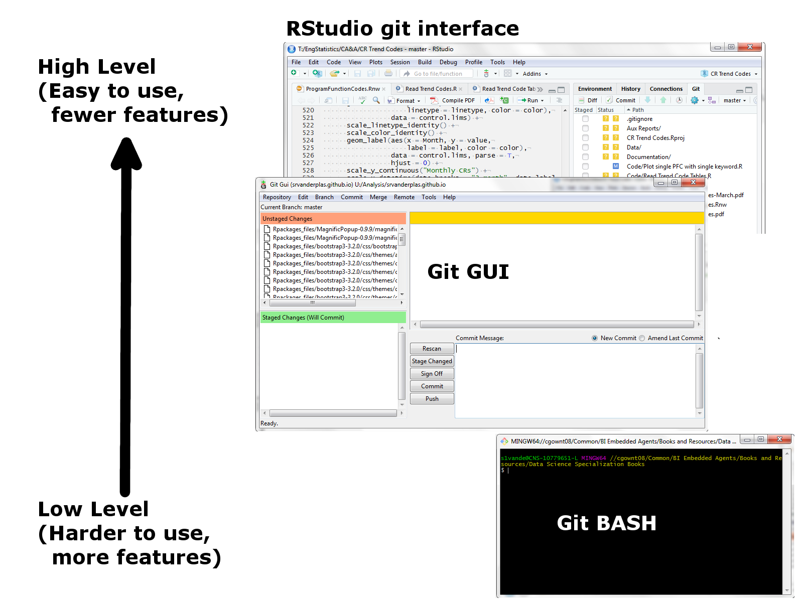
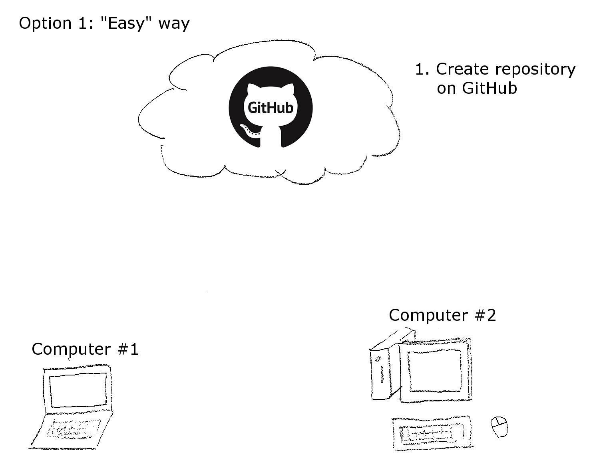
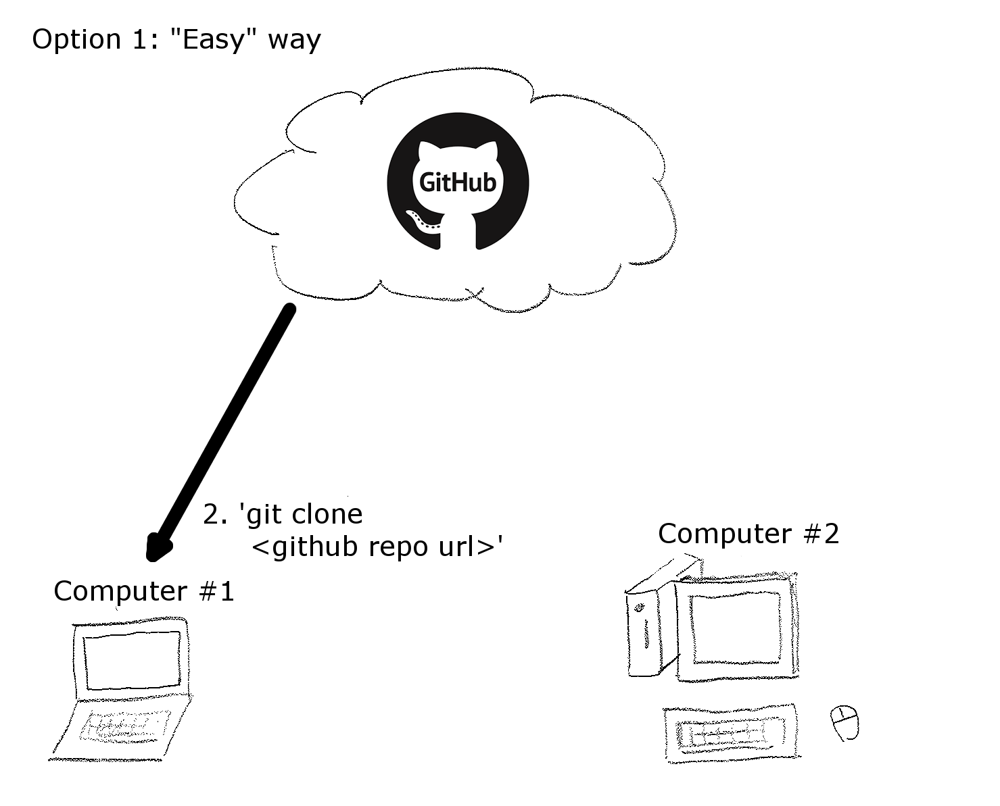
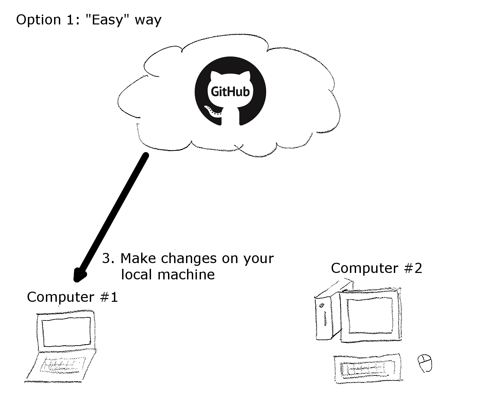
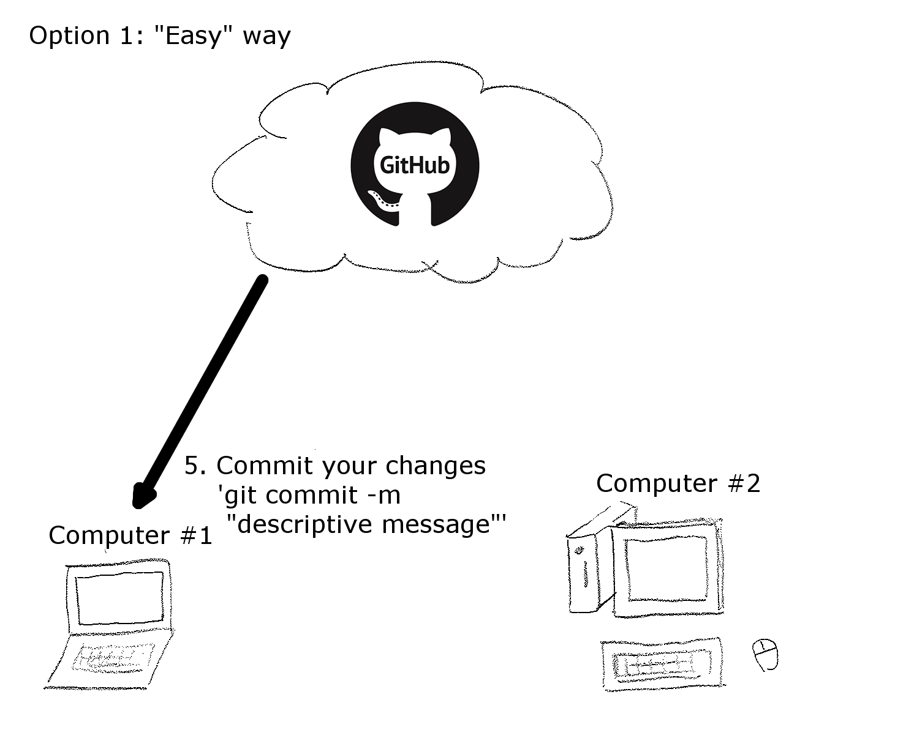
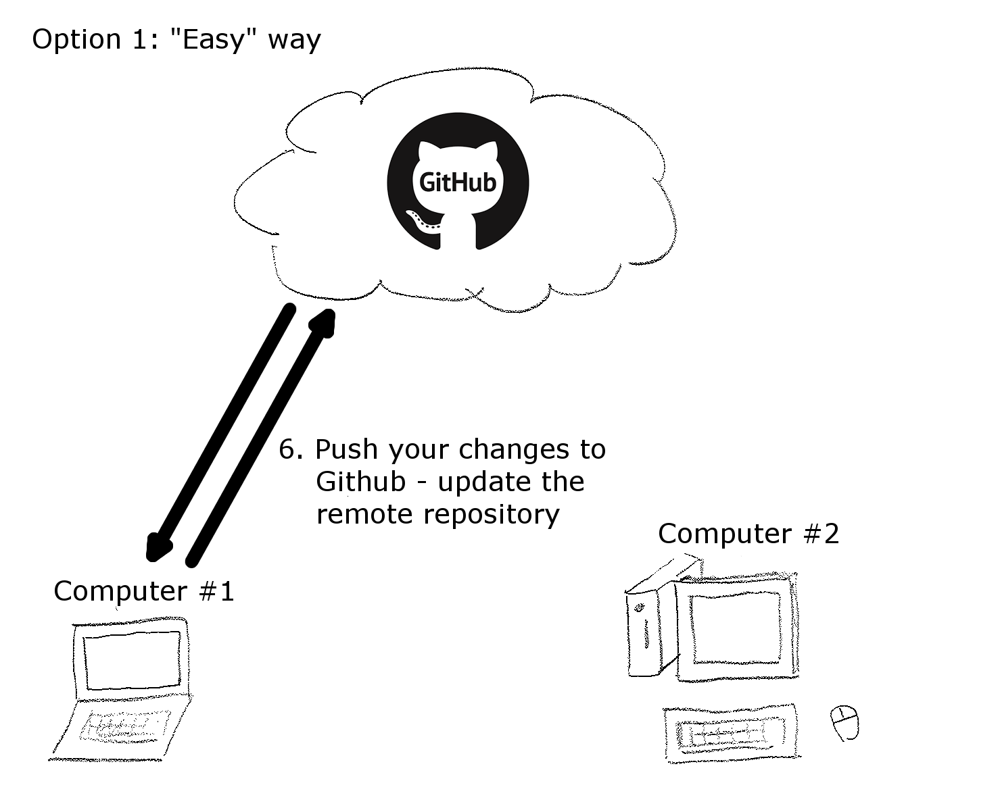
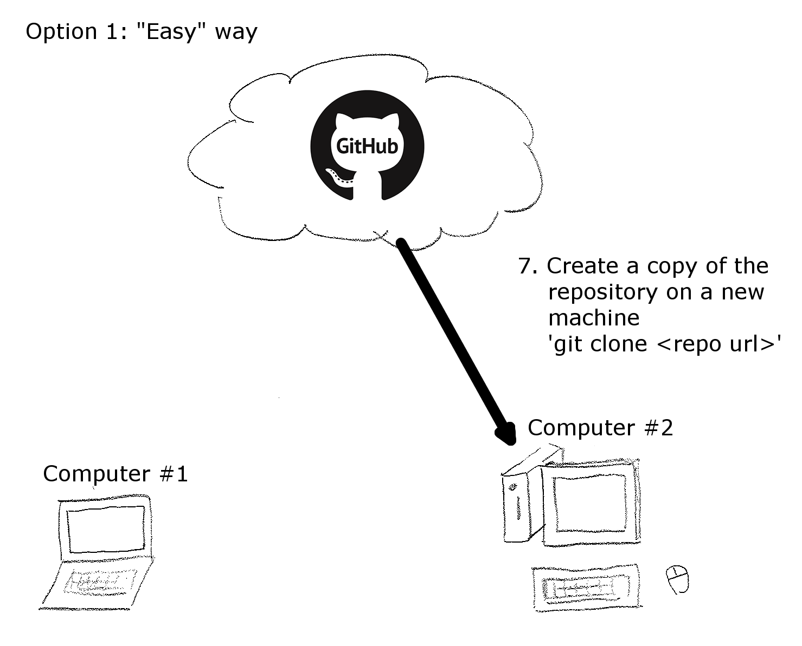
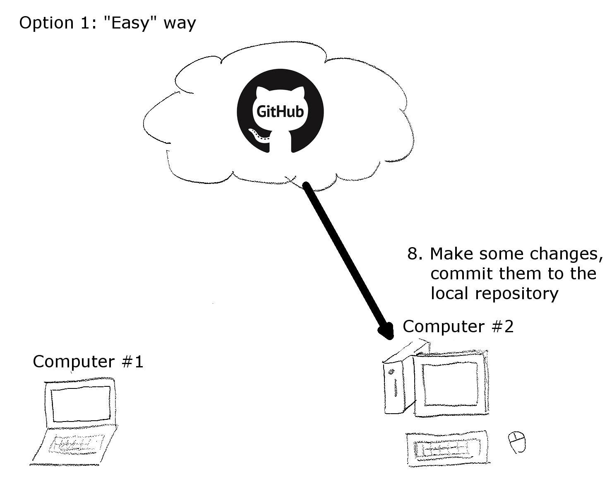
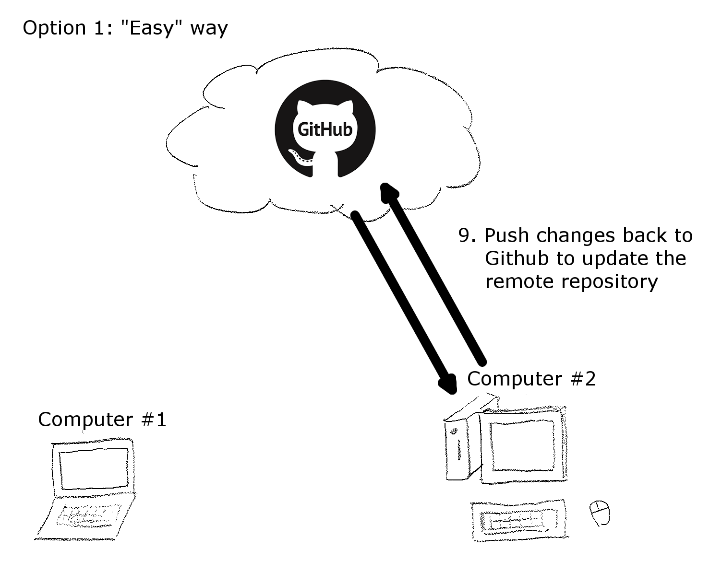
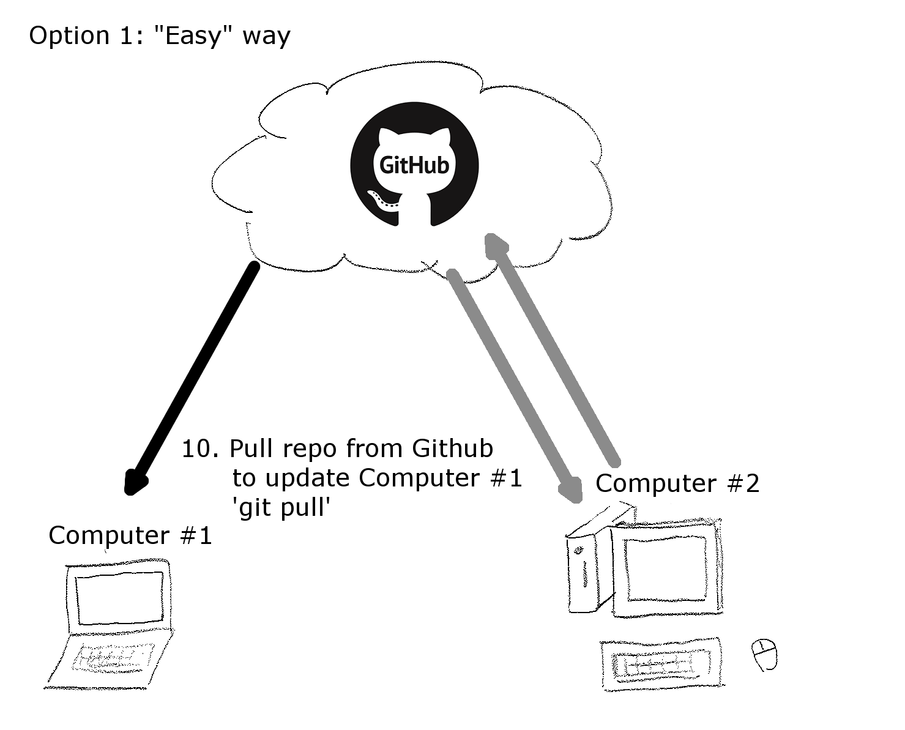

December 2017 - R Style Guide
========================================================
author: Susan VanderPlas
date: 2017-12-04
autosize: true

Progress Report
========================================================
type: section

### How's it going so far?

As of Monday, 12 people have completed Course 1 and one person has completed Course 2.

Average progress on Course 2 is 50.6%.

### What would make this experience better/easier next time?

(Vulcan mind meld isn't an option, unfortunately)


Questions
========================================================
type: section

### What isn't clear about the current material?


Git
========================================================
type: section


Git Tools
========================================================



Using Git 
========================================================



Using Git 
========================================================



Using Git 
========================================================



Using Git 
========================================================


Using Git 
========================================================



Using Git 
========================================================



Using Git 
========================================================



Using Git 
========================================================



Using Git 
========================================================



Using Git 
========================================================



Git in RStudio
========================================================


R Coding Style
========================================================
type: prompt

A set of conventions for programming that make code easily readable and sharable

NPPD will use a modified form of [Google's style guide](https://google.github.io/styleguide/Rguide.xml)

R Coding Style
========================================================
incremental: true

* File Names end in .R
* Variables: `variableName`
* Functions: `function_name` or `FunctionName`
* Lines less than 80 characters long
* Indent: use 2 spaces (no tabs)
* Assignment: Use `<-`. Do not use  `=` or `->`.

R Coding Style
========================================================

* Curly Braces: first on same line, last on own line


```r
my_fun <- function(x) {
  return(x)
}
```

R Coding Style
========================================================

* else: Surround with braces


```r
x <- 3

if (x > 2) {
  y <- 4
} else {
  y <- 2
}
```

R Coding Style
========================================================
incremental: true

File Layout:

* Author
* File Description
* Library statements
* Function Definitions
* Executed Statements


R Coding Style
========================================================


```r
# Author: Susan Vanderplas

# ------------------------------------------------------
# This file demonstrates the ideal layout of an R code 
# file. This block is for a description of the code's
# purpose and file contents. 
# ------------------------------------------------------

# --- Packages -----------------------------------------
library(ggplot2)
library(dplyr)
# ------------------------------------------------------
```

R Coding Style
========================================================


```r
myfun <- function(x) {
  # This function returns the value that is passed in
  # Basically, it does nothing.
  # Args:
  #   x: The value to be returned
  # Returns: 
  #   x: The value passed in to the function
  
  return(x)
}

# This code executes myfun on the value 3
myfun(3)
```

R Coding Style
========================================================
incremental: true

* Errors: `stop()` or `stopifnot()` should be used to generate errors
* Warnings: `warning("Message goes here")` should be used to generate warnings
* Messages: `message("Message goes here")` should be used to generate messages.
    * Debugging messages are useful, but should be commented out when code is
      ready for production.
