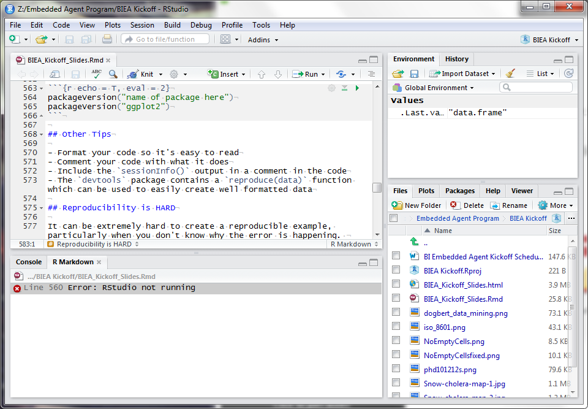

```{r setup, message = F, error = T, warning = F, echo = F}
progress_report <- read.csv("\\\\cgownt08\\Common\\BI Embedded Agents\\2018-01-08_Course_Completion.csv", stringsAsFactors = F)

library(dplyr)
library(purrr)
library(tidyr)
library(stringr)
library(ggplot2)
```
## Status Report

As of Monday (with 13 BI Embedded Agents)

```{r, echo = F, include = T, warning = F, message = F}
progress_report %>%
  filter(!External.Id %in% c("cabaler", "gajaspe")) %>%
  select(Name, Course, Overall.Progress, Completed) %>%
  complete(Name, Course, fill = list(Overall.Progress = 0, Completed = "No")) %>%
  mutate(Overall.Progress = ifelse(Completed == "Yes", 100, Overall.Progress),
         Course = str_replace(Course, "The Data Scientist(.*)", 
                              "The Data Scientist's Toolbox")) %>%
  group_by(Course) %>%
  summarize(
    Completed = sum(Completed == "Yes"),
    Avg.Progress = mean(Overall.Progress)
  )
```

## How's it going?

### What would make this easier next time?

## Outline

1. Creating a Reproducible Example
2. Q&A
3. How are you planning to use this material?

# Creating a Reproducible Example / Asking good questions
<!-- https://stackoverflow.com/questions/5963269/how-to-make-a-great-r-reproducible-example-->

## Asking good questions

- Inevitably, you will run into some issues with R
- Weird error messages
- How do you ask for help when you don't know what's causing the problem?

```{r echo = T, error = T}
prob1 <- data.frame(Education = c(1,2,3), Ethnicity = c(5,4,3))
table(prob1$Eduction, prob1$Ethnicity)
```

## Weird Error Messages: {.vcenter .flexbox}
<h2>Check your spelling!!</h2>

## Golden Rules of Asking Questions

0. R code should be able to be directly copied and run in an R session
1. Make your data reproducible
2. Make your code reproducible
3. Use proper R class names
```{r, echo = T, eval = T}
class(data.frame(x = c(1, 2, 3, 4)))
```

## Asking good questions

1. Start with what you're trying to accomplish
2. Provide data in a reproducible format
3. Describe what you would want to happen
4. Show the code AND THE OUTPUT
5. Ask the question: "What is going on?"

This allows anyone reading your question to figure out what is happening in your code and help you fix it.

## What is a Reproducible Example?

At a minimum, a reproducible example consists of:

- A minimal dataset necessary to reproduce the error
- the minimal runnable code necessary to reproduce the error
- information about the package versions, R version, and operating system
- when randomness is involved, a seed for reproducibility

## Producing a minimal dataset

- use a built in dataset
```{r, eval = F, echo = T}
library(help = "datasets")
data(mtcars) # built-in data
```

- create a vector/data frame with some values
- for complex data, 
    - provide a file with a few rows
    - use `dput` command to get code that will recreate the R object on someone else's machine

## Producing a minimal dataset
```{r, echo = T}
dput(head(mtcars)) # Code to recreate the first 6 rows
```
    
## Producing minimal code

- Make sure the provided data is in the correct format (no cleaning code) unless the error is in the data cleaning step
- Don't copy/paste the whole function. Locate the lines that cause the error specifically
- Add the packages used, if any
- If you open connections, add code to close them or delete the files
- If you change options, make sure the code will revert the changes
- Test your code in a new, empty session to make sure it's runnable

## Give Extra Information

```{r echo = T}
sessionInfo()
```

## Give Extra Information

```{r eval = F, echo = T}
rstudioapi::versionInfo()
```

```{r echo = T, eval = 2}
packageVersion("name of package here")
packageVersion("ggplot2")
```

## Other Tips

- Format your code so it's easy to read
- Comment your code with what it does
- Include the `sessionInfo()` output in a comment in the code
- The `devtools` package contains a `reproduce(data)` function which can be used to easily create well formatted data

## Reproducibility is HARD

It can be extremely hard to create a reproducible example, particularly when you don't know why the error is happening. 

These are guidelines and can be violated when necessary

If you can't create a reproducible example, seek help internally before going to StackOverflow/reddit/R mailing lists

## Reproducibility is HARD
When all else fails, take a screenshot
```{r out.width = "70%", echo=FALSE, align = "center"}

```


# Q&A

## What R questions do you have for me?

# How are you planning to use this material?